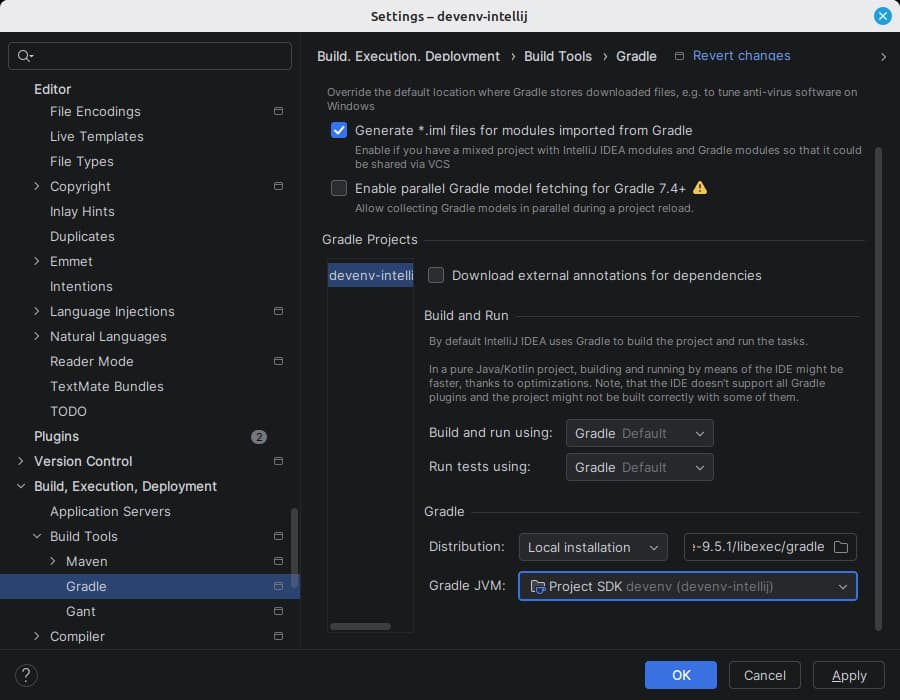

# Gradle

Linked Gradle builds use the Gradle devenv declares instead of the wrapper's, on the Project SDK.

|                |                                                                   |
| -------------- | ----------------------------------------------------------------- |
| devenv options | `languages.java.gradle.enable` `languages.java.gradle.package` |
| IDE setting    | Settings \| Build, Execution, Deployment \| Build Tools \| Gradle |

Left alone, the IDE runs the wrapper and downloads a second Gradle of its own. Every linked build under the devenv root is switched to the local distribution devenv provides, and to the Project SDK. Both apply from the next Gradle reload on; nothing here triggers one, since a sync is the user's to ask for.

A build declaring a Java toolchain still resolves it the Gradle way, which may mean downloading a JDK. That is the build's decision, not the IDE's, and nothing here overrides it.

