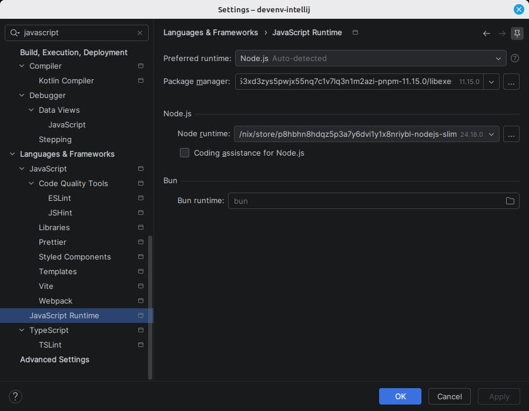

# Node.js

The Node.js interpreter and package manager are set to the ones devenv declares.

|                |                                                                                                                  |
| -------------- | ---------------------------------------------------------------------------------------------------------------- |
| devenv options | `languages.javascript.enable` `languages.javascript.package` `languages.javascript.{pnpm,yarn,npm}.enable` |
| IDE setting    | Settings \| Languages & Frameworks \| Node.js                                                                    |

The interpreter is the `bin/node` inside the store path, which is the binary the devenv shell puts first on `PATH`. Left alone, the IDE would go looking for a Node.js on the machine - a system install, an nvm version, whatever it found first.

The IDE has a single Package manager setting while devenv is happy to declare several, so the first the project enables wins, from the most deliberate choice to the least: pnpm, yarn, then the npm a project gets for merely having Node.js. It is only ever set, never cleared, since nothing can tell a manager the plugin set from one picked by hand.

Both apply at once - run configurations and the JavaScript tooling read them straight from the settings, with no reload in between.

