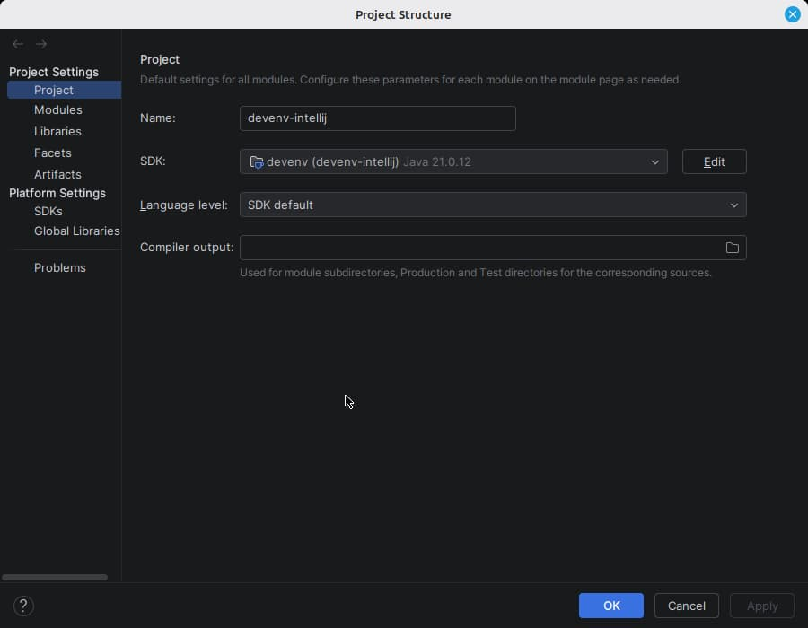

# Project SDK

The Project SDK is set to the JDK devenv declares, and put back when something moves it.

|                |                                                         |
| -------------- | ------------------------------------------------------- |
| devenv options | `languages.java.enable` `languages.java.jdk.package` |
| IDE setting    | File \| Project Structure \| Project \| SDK             |

The JDK home comes from `languages.java.jdk.package.home` rather than from the package itself: the store path of the nixpkgs OpenJDK holds no `release` file, so the IDE would refuse it as a JDK home. The `home` attribute is what the devenv shell exports as `JAVA_HOME`, so the IDE and a terminal agree.

A JDK chosen by hand in Project Structure is overwritten, on purpose - and so is one that a Gradle or Maven import assigns to the project on its way past.

