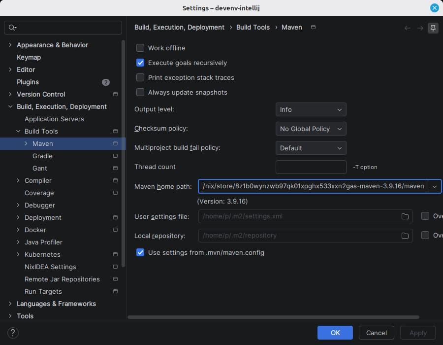

# Maven

The Maven home path is set to the Maven devenv declares instead of the one bundled with the IDE.

|                |                                                                  |
| -------------- | ---------------------------------------------------------------- |
| devenv options | `languages.java.maven.enable` `languages.java.maven.package`  |
| IDE setting    | Settings \| Build, Execution, Deployment \| Build Tools \| Maven |

A Maven home is the directory holding `bin/m2.conf`, which the nixpkgs Maven keeps under `maven/` inside the store path rather than at its root. It applies from the next Maven reload on.

