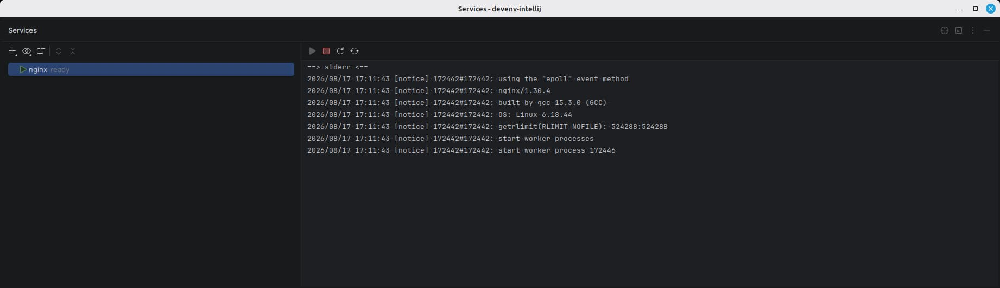

# Processes

The processes declared under `processes` appear in the Services tool window.

|                |                          |
| -------------- | ------------------------ |
| devenv options | `processes`              |
| IDE setting    | The Services tool window |

The declared processes are read with `devenv eval processes` and their status with `devenv processes list`, polled in the background. Each one can be started, stopped and restarted on its own, and the root node runs `devenv up -d` and `devenv down`.

A devenv project that declares no process shows no node at all: the platform hides a contributor whose list is empty.

